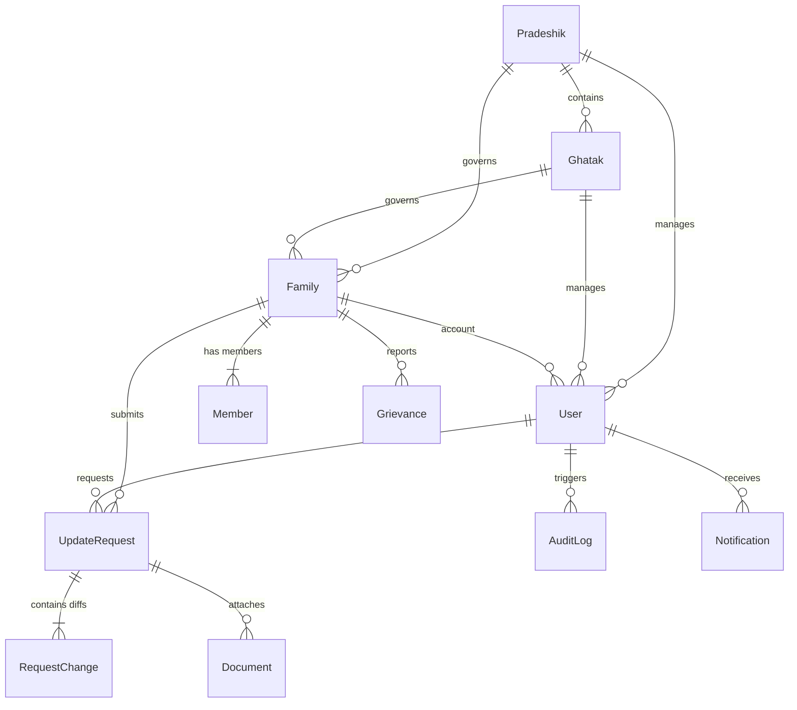

# Entity Relationship Diagram (ERD) & Database Specification
## Shri Kutch Gurjar Kshatriya Samaj Census Portal

---

## 1. Overview & Architecture

The database is built on **PostgreSQL** (hosted on Neon Serverless Postgres) and managed via **Prisma ORM**. The data model isolates administrative hierarchies (Pradeshik, Ghatak), family units (Family, Member), user authentication/sessions (User, VerificationCode), governance audit trails (UpdateRequest, RequestChange, AuditLog), communications (Notification, Notice, Grievance), and security rate limiting (OtpRateLimit, IpRateLimit).

---

## 2. Mermaid Entity Relationship Diagram

---

## 3. Data Models Specification

### 3.1 Territorial Models

#### `Pradeshik` (State/Regional Governance)
| Column | Type | Constraints | Description |
| :--- | :--- | :--- | :--- |
| `id` | String (UUID) | `@id` | Primary Key |
| `name` | String | `@unique` | Name of Pradeshik region |
| `code` | String | `@unique` | Code identifier |

#### `Ghatak` (Local Governance Cluster)
| Column | Type | Constraints | Description |
| :--- | :--- | :--- | :--- |
| `id` | String (UUID) | `@id` | Primary Key |
| `name` | String | `@unique` | Name of Ghatak cluster |
| `code` | String | `@unique` | Code identifier |
| `pradeshikId` | String | FK -> `Pradeshik.id` | Belongs to Pradeshik |

---

### 3.2 Census Core Models

#### `Family` (Family Unit Record)
| Column | Type | Constraints | Description |
| :--- | :--- | :--- | :--- |
| `id` | String (UUID) | `@id` | Primary Key |
| `familyId` | String | `@unique` | Human-readable ID (e.g. `KG-2026-00123`, `KG-NRI-0042`) |
| `headName` | String | Required | Full Name of Family Head |
| `mobile` | String | Indexed | Primary contact mobile number |
| `nativeVillage` | String? | Optional | Kutch village origin |
| `kutchVillage` | String? | Optional | Kutch traditional village |
| `country` | String? | Optional | Residence Country |
| `city` | String? | Optional | Residence City |
| `pradeshikId` | String? | FK -> `Pradeshik.id` | Territorial region |
| `ghatakId` | String? | FK -> `Ghatak.id` | Local cluster |

#### `Member` (Family Member Detail)
| Column | Type | Constraints | Description |
| :--- | :--- | :--- | :--- |
| `id` | String (UUID) | `@id` | Primary Key |
| `familyId` | String | FK -> `Family.id` | Belongs to Family (`onDelete: Cascade`) |
| `name` | String | Required | Full Name |
| `relation` | String | Required | Relation to Head (`Head`, `Wife`, `Son`, etc.) |
| `age` | Int | Required | Age in years |
| `gender` | Gender | Enum (`MALE`, `FEMALE`, `OTHER`) | Gender |
| `occupation` | String | Required | Profession / Job |
| `education` | String | Required | Educational qualification |
| `bloodGroup` | String | Required | Blood group (`A+`, `O+`, etc.) |
| `mobile` | String? | Optional | Personal mobile number |
| `email` | String? | Optional | Personal email address |
| `isAlive` | Boolean | `@default(true)` | Vital status |

---

### 3.3 Authentication & Authorization

#### `User` (Portal Account)
| Column | Type | Constraints | Description |
| :--- | :--- | :--- | :--- |
| `id` | String (UUID) | `@id` | Primary Key |
| `mobileNumber` | String | `@unique` | Primary mobile number |
| `email` | String? | `@unique` | Primary email address |
| `role` | Role | Enum (`USER`, `GHATAK_ADMIN`, `PRADESHIK_ADMIN`, `SUPER_ADMIN`, `NRI_ADMIN`) | RBAC Role |
| `isVerified` | Boolean | `@default(false)` | Verification status |
| `familyId` | String? | `@unique`, FK -> `Family.id` | Linked family record |
| `consentGivenAt` | DateTime? | Optional | DPDP Act 2023 consent timestamp |

#### `VerificationCode` (OTP Ledger)
| Column | Type | Constraints | Description |
| :--- | :--- | :--- | :--- |
| `id` | String (UUID) | `@id` | Primary Key |
| `mobileNumber` | String | Indexed | Mobile number or Email address |
| `code` | String | Required | SHA-256 hash of 6-digit OTP code |
| `attempts` | Int | `@default(0)` | Failed verification count (max 5) |
| `expiresAt` | DateTime | Required | OTP expiration time (10 mins) |

---

### 3.4 Governance & Audit Logs

#### `UpdateRequest` & `RequestChange`
- Stores approval requests for changing family member details or adding/removing members.
- `RequestChange` stores granular `tableName`, `recordId`, `fieldName`, `oldValue` (JSON), and `newValue` (JSON).

#### `AuditLog`
- Immutable system audit trail capturing `action` (`LOGIN`, `REGISTER`, `SUBMIT_REQUEST`, `APPROVE_REQUEST`, `EXPORT_NRI_CSV`, etc.), `description`, `userId`, `ipAddress`, and timestamp.

#### `JoinRequest`
- Self-registration / NRI enrollment ticket holding pending family details before admin approval.
