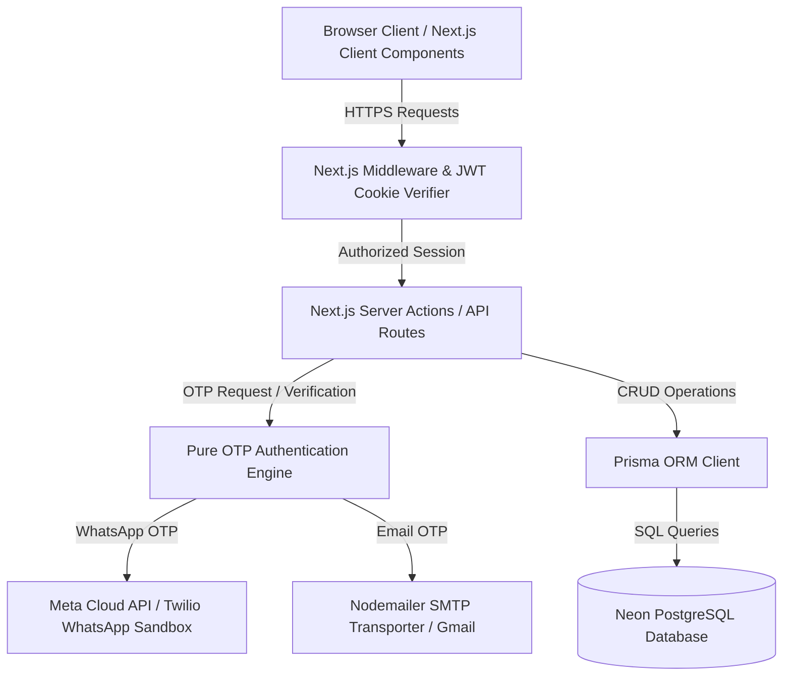

# System Design & Technical Architecture Document
## Shri Kutch Gurjar Kshatriya Samaj Census Portal

---

## 1. High-Level Architecture Diagram

---

## 2. Infrastructure & Technology Stack

| Layer | Technology Choice | Rationale |
| :--- | :--- | :--- |
| **Framework** | Next.js 15 (App Router, Server Actions, React Server Components) | High performance, unified full-stack TS architecture, zero client JS overhead for RSCs. |
| **Database** | Serverless PostgreSQL (Neon Tech) | Scale-to-zero capability, instant branching, connection pooling. |
| **ORM** | Prisma ORM | Type-safe schema generation, automated migrations, rich relation querying. |
| **Authentication** | Custom Pure OTP Engine + `jose` (JWT) | Passwordless, tamper-proof HTTP-only cookie session storage (`auth-token`, `refresh-token`). |
| **Email Delivery** | Nodemailer (SMTP / Gmail Transporter) | Minimalist inline-styled HTML templates with fallback console logging in dev mode. |
| **WhatsApp Messaging** | Twilio API / Meta Cloud API (WhatsApp Business) | High delivery rate to Indian & international mobile numbers. |
| **Bot Protection** | Cloudflare Turnstile CAPTCHA | Non-intrusive CAPTCHA triggered dynamically upon elevated rate-limit detection. |
| **Styling** | Vanilla CSS / TailwindCSS + Lucide Icons | Heritage Cream palette (`#FAF7F2`, `#8B5E3C`, `#2D2D2D`). |

---

## 3. Security Architecture & Threat Mitigation

### 3.1 Passwordless Pure OTP Mechanism
- **SHA-256 Hashing**: OTP codes are never stored in plain text. Only the SHA-256 hash (`crypto.createHash('sha256')`) is written to `VerificationCode.code`.
- **Short Lifetime**: Verification codes expire strictly after 10 minutes (`expiresAt: new Date(Date.now() + 10 * 60 * 1000)`).
- **Lockout Policy**: After 5 failed attempts (`verification.attempts >= 5`), the verification record is deleted immediately, locking out brute-force attacks.

### 3.2 Dual-Tier Rate Limiting
1. **IP Level (`IpRateLimit`)**: Maximum 5 OTP requests per client IP per 15 minutes.
2. **Identifier Level (`OtpRateLimit`)**: Maximum 3 OTP requests per phone number / email address per 15 minutes.
3. **Turnstile Trigger**: If an IP executes >2 mobile check requests within an hour, Cloudflare Turnstile CAPTCHA is dynamically mandated before issuing an OTP.

### 3.3 JWT Session Security
- Double-cookie token scheme:
  - `auth-token`: Access token valid for 1 day (`SameSite=Lax`, `HttpOnly`, `Path=/`).
  - `refresh-token`: Refresh token valid for 7 days (`SameSite=Lax`, `HttpOnly`, `Path=/`).
- **Silent Token Refresh**: `middleware.ts` automatically intercept requests with expired access tokens but valid refresh tokens, issuing fresh access tokens seamlessly.

---

## 4. Role-Based Access Control (RBAC) Matrix

| Module / Path | USER (Head) | GHATAK_ADMIN | PRADESHIK_ADMIN | SUPER_ADMIN | NRI_ADMIN |
| :--- | :---: | :---: | :---: | :---: | :---: |
| `/dashboard` (Family View) | ✅ | ✅ | ✅ | ✅ | ✅ |
| `/dashboard/family/edit` | ✅ (Own Family) | ✅ | ✅ | ✅ | ❌ |
| `/dashboard/requests` | ❌ | ✅ (Ghatak Scope) | ✅ (Pradeshik Scope) | ✅ (Global) | ❌ |
| `/dashboard/join-requests` | ❌ | ❌ | ❌ | ✅ | ✅ (NRI Scope) |
| `exportNriFamiliesAction` | ❌ | ❌ | ❌ | ❌ | ✅ |
| Notice Publishing | ❌ | ❌ | ✅ | ✅ | ❌ |
| Audit Log Viewing | ❌ | ❌ | ❌ | ✅ | ❌ |
