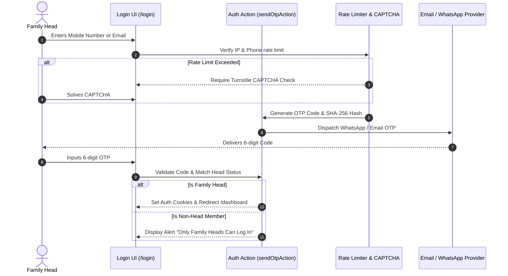
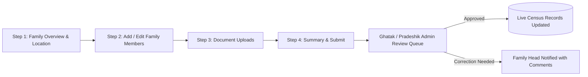

# User Experience (UX) & Workflow Pipeline Document
## Shri Kutch Gurjar Kshatriya Samaj Census Portal

---

## 1. UX Design Philosophy

The KGK Samaj Census Portal serves diverse demographics: elderly family heads, international diaspora (NRIs), and regional administrators. The design follows three principles:

1. **Simplicity over Complexity**: Eliminate cognitive overload. Standardize single-field auto-detection (Mobile or Email) and remove password setup hurdles.
2. **Clarity & Trust**: Heritage Cream aesthetic (`#FAF7F2`) evoking warmth, community pride, and official legitimacy.
3. **Frictionless Completion**: Step-by-step guided wizards with real-time validation and localized translations.

---

## 2. End-to-End User Journey Pipelines

### 2.1 Pure OTP Sign-In Pipeline (`/login`)

---

### 2.2 Edit Family Record Pipeline (`/dashboard/family/edit`)

#### UX Optimization Key Highlights:
- **Instant Validation**: Client-side validation of mandatory fields (age, relation, blood group).
- **Auto-Calculations**: Dynamic family head relation constraints.
- **Draft Recovery**: Session state preservation during navigation.

---

### 2.3 NRI Family Enrollment Pipeline (`/register?tab=ENROLL`)

1. **Form Submission**: NRI Family Head fills details (Name, Overseas Country, City, India Hometown, Native Village in Kutch, DPDP Consent).
2. **Queueing**: Request saved as `PENDING` in `JoinRequest` table.
3. **NRI Admin Review**: `NRI_ADMIN` receives request notification in `/dashboard/join-requests`.
4. **Approval Action**: Admin verifies authenticity and approves request -> Automatically generates a new `Family` record with unique ID (e.g. `KG-NRI-00104`), populating the Head as primary member.
5. **Activation**: Family Head receives confirmation email/message to log in immediately via OTP.

---

## 3. Recommended UX Enhancements & Future Roadmap

1. **Auto-Fill & OCR Document Scanning**: Allow Family Heads to upload Aadhaar / Passport documents to auto-populate member names, birth dates, and addresses.
2. **Family Tree Visualization**: Interactive SVG family tree viewer on the dashboard page allowing family heads to visually inspect lineage.
3. **WhatsApp Bot Companion**: Interactive WhatsApp chatbot permitting Family Heads to request OTP, check update request status, and view announcements directly inside WhatsApp.
4. **Offline PWA Support**: Progressive Web App capabilities for census enumerators visiting remote villages with poor internet connectivity.
